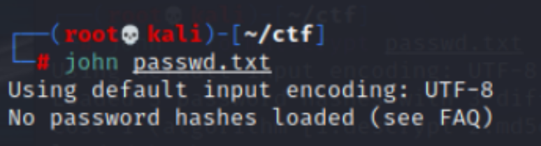
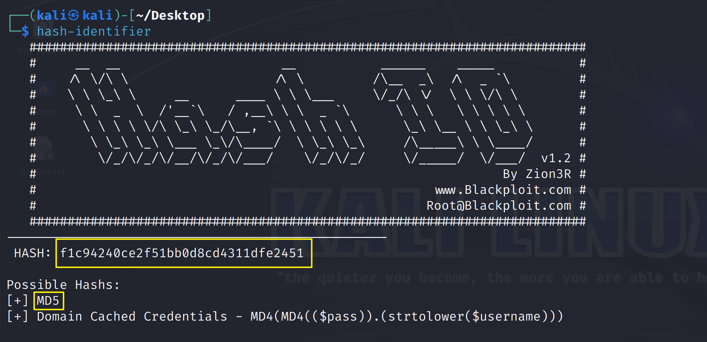

### John解密

>  John the Ripper是一款在已知密文的情况下尝试破解明文的密码破解工具，支持DESs、MD4、MD5等大多数的加密算法。其主要破解不够牢固的UNIX/Linux系统密码

使用John工具需掌握两个命令， 分别是：unshadow和john命令

- `unshadow`命令可以将系统中已经加密过的用户文件与密码文件相互组合，生成可被爆破的文本

- `john`命令是该工具的破解命令

在爆破过程中将使用默认字典进行匹配爆破，`默认字典存储在`Kali Linux下的`/usr/share/john/password.lst`文件中

==**命令格式**==：

```bash
john --format=[加密方式] --wordlist=[字典路径] [待解密密文文件]
```


#### 1、破解Kali系统中的用户密码

首先需要使用John提供的的unshadow命令，因为john 对于需要使用的数据格式有一定要求，所以我们需要使用unshadow指令，合并/etc/passwd的数据和/etc/shadow的数据，然后使用重定向符号`> `passwd.txt 指定生成的文件名称；

```bash
sudo unshadow /etc/passwd /etc/shadow > passwd.txt
```

然后使用Kali中的john工具对生成的passwd.txt文件使用***默认顺序破解模式（Wordlist mode）\***进行破解,但是此时可能出现报错提示如下：此时提示***“No password hashes loaded （未加载密码哈希）”\***

```bash
john passwd.txt
```



**出错原因**：John无法识别当前加密方式（在编译过程中，没有指定合适的系统版本；导致编译出来的 john 文件不能识别64位机器的hash密码.）

解决方法：更换编译指令/指定加密算法

这里更换编译指令比较麻烦，因此我们通常进行手动指定加密算法，我们可以了解从Debian 11 / bullseye 系统 （适用于Kali）开始中的/etc/shadow文件中默认使用的密码哈希函数为：`yescrypt`

因此在Kali系统中我们只需要添加`--format=[xxx]`参数，即可指定John使用指定算法破解密码：


```bash
john --format=crypt passwd.txt
```

再次查看破解后的密码只需执行如下命令：

```bash
john --show passwd.txt
```

#### 2、如何识别常见的密码加密类型（如何选择--format=[]参数）

- 在线哈希识别器：https://hashes.com/en/tools/hash_identifier

- Hash-identifie：https://gitlab.com/kalilinux/packages/hash-identifier/-/tree/kali/master

```bash
安装：
wget https://gitlab.com/kalilinux/packages/hash-identifier/-/raw/kali/master/hash-id.py
使用命令：
python3 hash-id.py
简单地启动它,输入你想要识别的hash值，它就会给出这个hash值可能对应的hash类型
```



#### 3、zip2john：破解受密码保护的Zip压缩文件

使用 `zip2john` 工具将 zip 文件转换为 John 能够理解的哈希格式（提取hash值），zip2john 的基本用法是这样的：

```bash
zip2john [options] [zip file] > [output file]
 
[options]           允许你向 zip2john 传递特定的校验和选项，这通常是不必要的
[zip file]          希望提取hash值的zip文件的路径
>                   这是输出指示器，我们用它来将这个文件的输出发送到..。
[output file]       这个文件将存储输出结果
 
示例用法
zip2john zipfile.zip > zip_hash.txt
```


```bash
john --wordlist=/usr/share/john/password.lst zip_hash.txt
```


