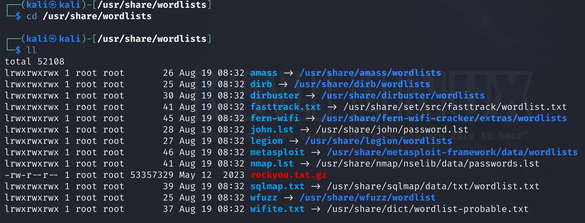
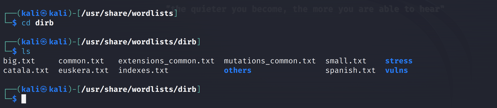

暴力破解能成功最重要的条件还是要有一个强大的密码字典！Kali默认自带了一些字典，在 `/usr/share/wordlists `目录下





```
big.txt #大的字典
small.txt #小的字典
catala.txt #项目配置字典
common.txt #公共字典
euskera.txt #数据目录字典
extensions_common.txt #常用文件扩展名字典
indexes.txt #首页字典
mutations_common.txt #备份扩展名
spanish.txt #方法名或库目录
others #扩展目录，默认用户名等
stress #压力测试
vulns #漏洞测试
```


